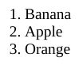
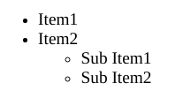

# HTML Basics

A basic html file will always have these tags/features.
```html
<!DOCTYPE html>
<html>
  <head>
    <title></title>
  </head> 
  <body>
  </body>
</html>
```

#### DOCTYPE

It tells the browser what document type to expect.
ex HTML 5.

`<!DOCTYPE html>`

#### Lists
1. Ordered List Tag

```html
<ol>
  <li>Banana</li>
  <li>Apple</li>
  <li>Orange</li>
</ol>
```
**Output**

<p></p>

2. Unordered List Tag
```html
<ul>
  <li>Item1</li>
  <li>Item2</li>
  <ul>
    <li>Sub Item1</li>
    <li>Sub Item2</li>
  </ul>
</ul>
```
**Output**

<p></p>

#### Adding extra line
This can be done by using break tag.
```html
<br>
```
It is a self closing tag.

In old version it can also be written as `<br />`.

#### Img Tag

```html

```
* Self closing tag.
* Width and height are in **PIXELS**.
* alt -> Defines alternative text for the image.

#### Anchor Tag

```html
<a href = "newPage.html">New Page</a>
```

* Hyper Link tag.